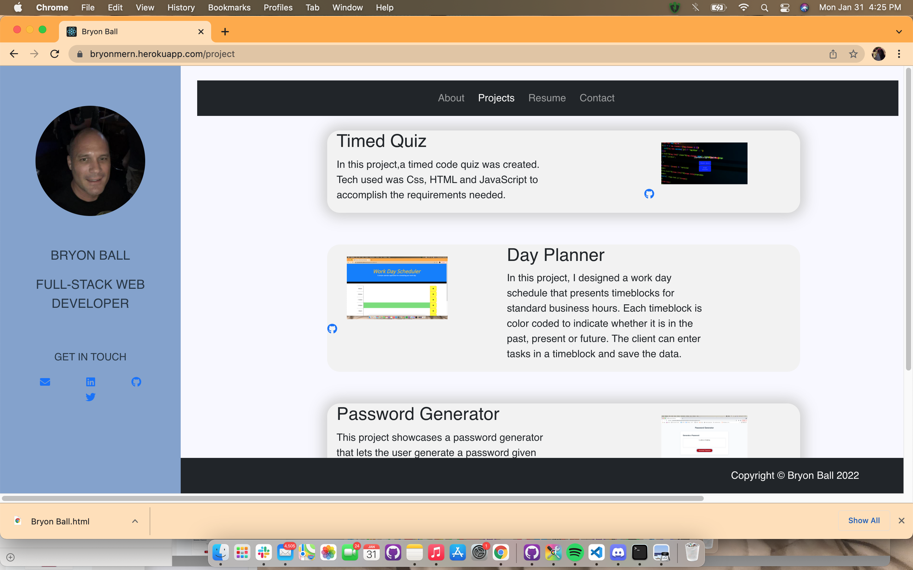

# React Portfolio
Homework 20

 

# Link to deployed app

## [Click](https://bryonmern.herokuapp.com/project)

# Technologies used:

Mysql, MongoDB, Express, React, Mongoos, Node.js, eslint, JavaScript, Css, Jsx, Html. 

# Overview

For this assignment, the task is to create a portfolio using new React skills, which will help set me apart from other developers whose portfolios don’t use the latest technologies. 

# License
MIT
 
# Contact Info
https://github.com/bryonbsmb1
